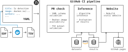

# SzCORE

- website: [https://epilepsybenchmarks.com](https://epilepsybenchmarks.com)

## Background

This repository hosts an open [seizure detection benchmarking platform](https://epilepsybenchmarks.com).
The aim is to provide an open source platform for the community to submit their seizure detection algorithms and provide automatic benchmark results on various high quality datasets.

## Usage

Users can submit a containerized algorithm by opening a PR adding a yaml file in the `algorithms` directory. The yaml file should describe their algorithm following our schema (see [example](algorithms/gotman.yaml)) and point to a publicly available docker image based on our template (see [config/template.Dockerfile](config/template.Dockerfile)).

Once the PR is merged, this image is used to execute the algorithm on GitHub actions, compute performance metrics and update a [static website](https://epilepsybenchmarks.com) hosted on GitHub pages.

## Data flow

### Algorithm submission

To submit an algorithm, you will need to take the following steps:
1. Fork the repository into your namespace
2. Add a yaml file describing your algorithm in [`algorithms/`](https://github.com/esl-epfl/szcore/tree/main/algorithms)
   - You can start by copying [gotman.yaml](https://github.com/esl-epfl/szcore/blob/main/algorithms/gotman.yaml) to get the right structure and adapt the contents.
3. Build a docker image containing your algorithm by adapting our [template.Dockerfile](https://github.com/esl-epfl/szcore/blob/main/config/template.Dockerfile)
   - It is important to ensure that CMD (at the end of template) runs inference by reading and writing to the predefined paths.
   - Note that inference happens offline, all dependencies must be downloaded in the build step.
4. Push the image to a public image registry (e.g. docker.io), making sure it is pulbicly accessible.
   - Make sure the `image` key in your yaml file points to your custom image. It will be used in the benchmark.
5. open a Pull Request
   - The yaml file and docker image will be verified by automatic CI checks.
6. Once all checks pass, we will merge the PR, adding your algorithm to the benchmark.

## Acknowledgement

This project was developed as part of the [ORD for the Sciences hackathon](https://sdsc-hackathons.ch/) organized by [EPFL Open Science](https://www.epfl.ch/research/open-science/) and [SDSC](http://datascience.ch/) by the team "zinalrothorn", composed of [@EishaMazhar](https://github.com/EishaMazhar), [@danjjl](https://github.com/danjjl), [@esthertsw](https://github.com/esthertsw) and [@cmdoret](https://github.com/cmdoret).

SzCORE originated from the synergy of the [Pedesite](https://data.snf.ch/grants/grant/193813) consortium ([EPFL-ESL](https://www.epfl.ch/labs/esl/), [ETH-IIS](https://iis.ee.ethz.ch/), [CHUV](https://www.chuv.ch/fr/neurologie/nlg-home), [EPFL-LTS4](https://www.epfl.ch/labs/lts4/)).
