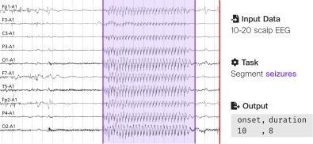

In partnership with [The International Conference on Artificial Intelligence in Epilepsy and Other Neurological Disorders](https://www.aiepilepsy-neuro.com/) (2025), [EPFL](https://www.epfl.ch/labs/esl/) and partners are organizing a seizure detection challenge.

| Key Dates        | Description       |
|------------------|-------------------|
| December 2024    | Challenge begins!  |
| 16 February 2025 | Submissions close. <a href="https://forms.gle/Qr2Psv4ZJbqXyujP9"><b>Submit</b></a> early.  |
| 3-6 March 2025   | Winners are announced during the <a href="https://www.aiepilepsy-neuro.com/">AI in Epilepsy</a> conference. |

## Background and impact

Epilepsy is the most common chronic brain disease and affects people of all ages. More than 50 million people worldwide have epilepsy. Scalp EEG-based seizure detection algorithms can optimize and facilitate the diagnostic workup performed on people with epilepsy to improve patients' care and quality of life [\[1\]](https://doi.org/10.1111/epi.14052).

EEG-based seizure detection aims to detect the onset and duration of all seizures in an EEG recording. The task has benefited from advances in machine learning. However, a relative scarcity of public datasets and a lack of standardization hinder progress in the field. This likely explains the lack of adoption of state-of-the-art algorithms in clinical practices. Recently, [SzCORE](https://doi.org/10.1111/epi.18113) has proposed a method to standardize dataset formats, evaluation methodology, and performance metrics.

In this machine learning challenge, we will leverage the standardization proposed by SzCORE. We ask the participants to build models on any combination of standardized publicly available datasets or private datasets. The model should perform a segmentation task by identifying the onset and duration of all epileptic seizures given a long-term, continuous, EEG as an input. The Models will then be evaluated on a large hold-out dataset using the event-based F1 score as the evaluation metric.

## Challenge description

### Objective

This challenge aims to build a seizure detection model that detects the onset and duration of all epileptic seizures in a recording from long-term EEG from the epilepsy monitoring unit.



### Input signal

Continuous long-term EEG signals from the epilepsy monitoring unit are provided as input data. The recordings are stored in [`.edf` files](https://www.edfplus.info/). They contain the 19 electrodes of the international [10-20 system](https://en.wikipedia.org/wiki/10%E2%80%9320_system_(EEG)) in a [referential, common average montage](https://www.learningeeg.com/montages-and-technical-components#referential). The channels are provided in the following order: `Fp1-Avg, F3-Avg, C3-Avg, P3-Avg, O1-Avg, F7-Avg, T3-Avg, T5-Avg, Fz-Avg, Cz-Avg, Pz-Avg, Fp2-Avg, F4-Avg, C4-Avg, P4-Avg, O2-Avg, F8-Avg, T4-Avg, T6-Avg`. The recordings are sampled at 256 Hz. The recordings contain continuous EEG signals. They are guaranteed to last at least 10 minutes. Most recordings are approximately one hour long. File size is guaranteed to be smaller than 4 GB.


### Model output

The model should generate a tab-separated values `.tsv` file as an output. This is a text file that uses a tab as a delimiter to separate the different columns of information, with each row representing one seizure event. Each annotation file is associated with a single EEG recording.

The annotation file is [HED-SCORE](https://hed-schemas.readthedocs.io/en/latest/hed_score_schema.html) compliant. It contains the following information:

- **onset:** represents the start time of the event from the beginning of the recording, in seconds.
- **duration:** represents the duration of the event, in seconds.
- **event:** indicates the type of the event. The event field is primarily used to describe the seizure type. Seizure events begin with the value `sz`. Recordings with no seizures can use the string `bckg` with the event duration equal to the recording duration.
- ***confidence:*** represents confidence in the event label. Values are in the range \[0–1\] \[no confidence – fully confident\]. This field is intended for the confidence of the output prediction of machine learning algorithms. It is optional, if it is not provided value should be `n/a`.
- ***channels:*** represents channels to which the event label applies. If the event applies to all channels, it is marked with the value `all`. Channels are listed with comma-separated values. It is optional, if it is not provided value should be `n/a`.
- **dateTime:** start date time of the recording file. The date time is specified in the POSIX format `%Y-%m-%d %H:%M:%S` (e.g., `2023-07-24 13:58:32`). The start time of a recording file is often specified in the metadata of the `edf`.
- **recordingDuration:** refers to the total duration of the recording file in seconds.

Here is an example of a HED-SCORE compliant annotation file with three seizures:

```tsv
 onset	duration	eventType	confidence	channels	dateTime	         recordingDuration
 296.0	40.0    	sz      	n/a     	n/a     	2016-11-06 13:43:04	 3600.00
 453.0	12.0    	sz      	n/a     	n/a     	2016-11-06 13:43:04	 3600.00
 895.0	21.0    	sz      	n/a     	n/a     	2016-11-06 13:43:04	 3600.00
```

In this challenge the `confidence` and `channels` fields are not used. They will not be evaluated.

### Training data

Challenge participants are encouraged to train their models on any combination of the three publicly available large datasets or any private datasets they might have access to. The main public datasets are:

| Dataset | \# subjects | duration \[h\] | \# seizures |
|---|---|---|---|
| [CHB-MIT *](https://physionet.org/content/chbmit/1.0.0/) | 24 | 982 | 198 |
| [TUH EEG Sz Corpus](https://isip.piconepress.com/projects/tuh_eeg) | 675 | 1476 | 4029 |
| [Siena Scalp EEG](https://physionet.org/content/siena-scalp-eeg/1.0.0) | 14 | 128 | 47 |

*\* The Physionet CHB-MIT Scalp EEG Database contains bipolar EEG channels and not referential channels as expected in this challenge.*

To facilitate model training across multiple datasets, we provide the following library to convert these datasets to the SzCORE standardized format for data and seizure annotations.



We provide the Physionet CHB-MIT and Siena Scalp EEG Databases in this format on Zenodo:

- [BIDS CHB-MIT Scalp EEG Database](https://zenodo.org/records/10259996)
- [BIDS Siena Scalp EEG Database](https://zenodo.org/records/10640762)

The licenses of the other datasets require you download and convert them yourself.

### Evaluation

Submissions will be evaluated on event-based F1 score computed on a private dataset of more than 2500 hours of data recorded in an epilepsy monitoring unit. In case of a tie on F1 score, sensitivity will be used as a secondary evaluation metric.

Event based scoring relies on overlap. If the reference event and the hypothesis event overlap, it is a correct detection (`True Positive`). If the hypothesis event does not overlap with a reference event it is a false detection (`False Positive`).


The following event-based scoring parameters are used in this challenge:

- **Minimum overlap:** between the reference and hypothesis for a detection. We use any overlap, however short, to enhance sensitivity.
- **Pre-ictal tolerance:** tolerance with respect to the onset of an event that would count as a detection. We use a 30 seconds pre-ictal tolerance.
- **Post-ictal tolerance:** tolerance with respect to the end time of an event that would still count as a detection. We use a 60 seconds post-ictal tolerance.
- **Minimum duration:** between events resulting in merging events that are separated by less than the given duration. We merge events separated by less than 90 seconds which corresponds to the combined pre- and post-ictal tolerance.
- **Maximum event duration:** resulting in splitting events longer than the given duration into multiple events: We split events longer than 5 minutes.

The [`timescoring`](https://github.com/esl-epfl/timescoring) library is used to compute these scores.



Results are computed on a subject by subject basis. Overall results are computed as the average across all subjects. The [`szcore-evaluation`](https://github.com/esl-epfl/szcore-evaluation) library is used to compute the overall score.



## Submission guidelines

Participants submit a pre-trained model packaged as a Docker image. The image should be publicly available on an image registry. Participants are allowed a maximum of three submissions. Participants are invited to submit a poster in addition to the challenge submission. Details on poster submissions are available on the [conference website](https://www.aiepilepsy-neuro.com/abstract.aspx).

### Docker image

The image should contain the following two volumes:

```Dockerfile
VOLUME ["/data"]
VOLUME ["/output"]
```

The `/data` volume is read-only. It contains the EEG file that should be analyzed. The `/output` volume is read-write. The algorithm should write the output `.tsv` file in this folder.

The image should define the following two environment variables:

```Dockerfile
ENV INPUT=""
ENV OUTPUT=""
```

The `INPUT` and `OUTPUT` environment variables contain the path to the input `.edf` file and output `.tsv` file relative to the `/data` and `/output` folders.

The image should define a `CMD` that takes the `INPUT` and `OUTPUT` to produce the output `TSV` file. Here is an example of such a `CMD`:

```Dockerfile
CMD python3 -m gotman_1982 "/data/$INPUT" "/output/$OUTPUT"
```

An example of a Docker packaged algorithm can be found here:



The docker images are run on a machine that is not connected to internet. It allows the following resource usage for processing a one-hour EEG file:

- 10 CPU cores
- 40 GB peak RAM
- 1 V100 GPU
- 15 min run time

### Submission form

The submission form contains the following fields:

```yaml
title: "Name of the algorithm" 
image: "registry path"
authors: "List of authors"
abstract: "Short Algorithm description."
license: "Algorithm License"
datasets: "List of datasets used in training"
repository: [OPTIONAL] "Algorithm source code"
publication: [OPTIONAL] "DOI to published algorithm"
```

The algorithms submitted here remain the strict property of the inventor. Neither the conference organizers nor the challenge sponsors have any intellectual property claims on the algorithms. The conference organizers will not share or disseminate them after the evaluation of the model. They will use the algorithms during the challenge to evaluate performance on a holdout dataset.

To be eligible to receive the prize money, at least one co-author of the algorithm **must be registered** (in person or virtual) for the conference. Teams that are not registered can participate, but they will not be eligible to win.


Submit a new entry


## Timeline




Challenge is publicly announced! Participants are invited to start working.



Submit your algorithm anytime! You are invited to <a href="https://forms.gle/Qr2Psv4ZJbqXyujP9"><b>submit</b></a> early to make sure your submission complies with challenge guidelines.



Challenge results are announced during <a href="https://www.aiepilepsy-neuro.com/">The International Conference on Artificial Intelligence in Epilepsy and Other Neurological Disorders</a> conference.




## Awards

[ceribell®](https://ceribell.com/), as the challenge sponsor, is generously offering $10.000 to challenge participants.

The prize money will be split among the two algorithms with the best event-based F1 score computed on a private dataset :

1. $7.000
2. $3.000

If your solution places 1st or 2nd on the final leaderboard, you will be required to submit your winning solution code to us for verification, and you thereby agree to share your solution under a CC-BY SA 4.0 license in order to receive the prize money.

The challenge organizers will write a summary of the outcome of the challenge in a leading journal in our field. The top challenge contributors will be invited to contribute to this paper to describe their methodology.

## Organizers

The challenge is organized by the [Embedded Systems Laboratory](https://www.epfl.ch/labs/esl/) of EPFL in collaboration with [CHUV](https://www.chuv.ch/fr/neurologie/nlg-home), [IIS-ETH](https://iis.ee.ethz.ch/) and the organizing committee of [The International Conference on Artificial Intelligence in Epilepsy and Other Neurological Disorders](https://www.aiepilepsy-neuro.com/).

For questions to the organizers you can contact [Jonathan Dan](https://people.epfl.ch/jonathan.dan/?lang=en).

## Sponsor

This challenge is generously sponsored by [ceribell®](https://ceribell.com/).


