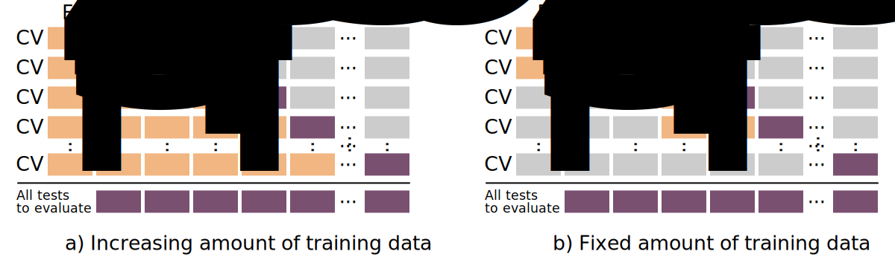
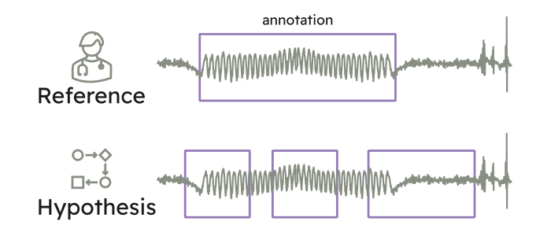
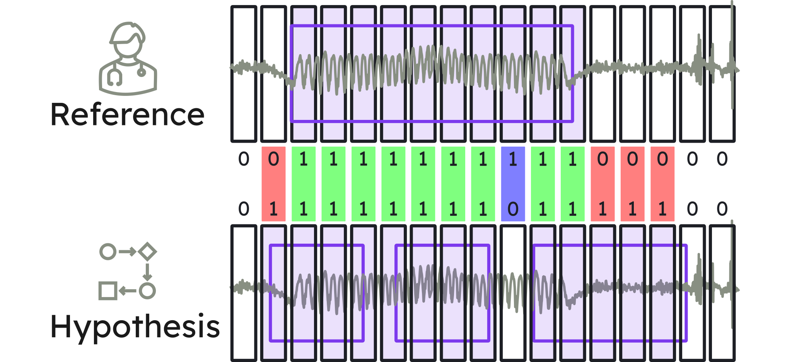
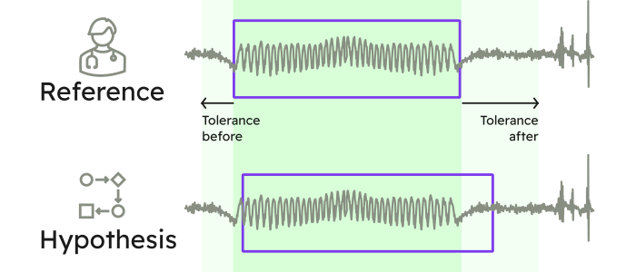
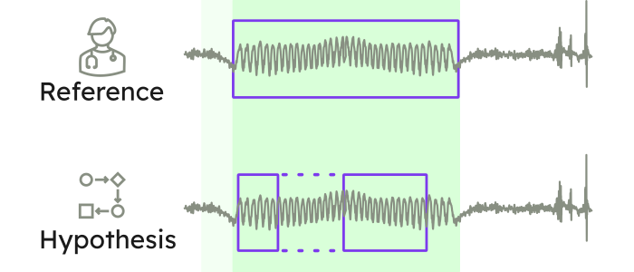

Methodological choices for the validation of automated seizure detection algorithms have a large influence on the reported results. In particular the datasets used along with the [cross-validation](https://en.wikipedia.org/wiki/Cross-validation_(statistics)) strategy and performance metrics can lead to radically different results for the evaluation of a given algorithm. This has been illustrated in several publications that investigate the effect of different methods for computing performance metrics \[[1](https://arxiv.org/pdf/2302.10672.pdf), [2](https://doi.org/10.1007/978-3-030-67494-6_8)\], in publications that investigate the effect of different data segmentation methods to divide a dataset into a training and testing set \[[1](https://arxiv.org/pdf/2302.10672.pdf), [3](https://doi.org/10.3390/app13074262)\], and is a well-know limitation of current reviews of seizure detection algorithms \[[4](https://doi.org/10.1111/EPI.14052)\].

1. [Pale U, Teijeiro T, Atienza D. “Importance of methodological choices in data manipulation for validating epileptic seizure detection models”. *Arxiv.* 2023.](https://arxiv.org/pdf/2302.10672.pdf)
2. [Shah V, Golmohammadi M, Obeid I, Picone J. “Objective Evaluation Metrics for Automatic Classification of EEG Events”. *In: Obeid I, Selesnick I, Picone J (eds) Biomedical Signal Processing. Springer*. 2021; pp 223–255.](https://doi.org/10.1007/978-3-030-67494-6_8)
3. [Shafiezadeh S, Duma GM, Mento G, Danieli A, Antoniazzi L, Del Popolo Cristaldi F, Bonanni P, Testolin A. “Methodological Issues in Evaluating Machine Learning Models for EEG Seizure Prediction: Good Cross-Validation Accuracy Does Not Guarantee Generalization to New Patients”. *Applied Sciences*. 2023; 13(7):4262.](https://doi.org/10.3390/app13074262)
4. [Baumgartner C, Koren JP. “Seizure detection using scalp-EEG”. *Epilepsia*; 2018 *59*, 14–22.](https://doi.org/10.1111/EPI.14052)

---


SzCORE is published in [Epilepsia](https://doi.org/10.1111/epi.18113) !
{.text-xl}


[Here](#papers-that-use-szcore) you will find a list of papers that make use of the framework.

---

## Scalp EEG datasets

To the best of our knowledge, there currently are three publicly available datasets of scalp EEG from people with epilepsy annotated by medical specialists that contain at least 10 subjects and at least 100 hours of recording.

| Dataset | \# subjects | duration \[h\] | \# seizures |
|---|---|---|---|
| [CHB-MIT](#physionet-chb-mit-scalp-eeg-database) | 24 | 982 | 198 |
| [TUH EEG Sz Corpus](#tuh-eeg-seizure-corpus) | 675 | 1476 | 4029 |
| [Siena Scalp EEG](#physionet-siena-scalp-eeg) | 14 | 128 | 47 |

### Physionet CHB-MIT Scalp EEG Database

- v1.0.0

This database is one of the oldest large publicly available scalp EEG datasets of people with epilepsy. It consists of 24 sessions of continuous EEG collected on 23 children (aged 1.5-22y). It was collected at the Boston Children’s Hospital. The subjects were monitored for up to several days following withdrawal of anti-seizure medication in order to characterize their seizures and assess their candidacy for surgical intervention.

The signals were acquired at 256 Hz and contain a minimum of 23 EEG channels positioned according to the 10-20 system. Some sessions contain additional physiological signals such as ECG or vagal nerve stimulation. Files are stored as `.edf` in recordings of one hour to four hours long. In most cases, time gaps between recordings are shorter than 10 seconds. Total session duration per subject is at least 19 hours.

The annotations are marked as the start and stop time of each epileptic seizure. They are provided as text file and as PhysioNet binary `.seizure` files.

The original dataset can be downloaded on the [Physionet website](https://physionet.org/content/chbmit/1.0.0/). We also compiled a BIDS compatible version of the dataset that implements the standardized format described in this framework. It can be downloaded on [Zenodo](https://zenodo.org/records/10259996).


BIDS CHB-MIT Scalp EEG Database


### TUH EEG Seizure Corpus

- v2.0.0

This database is a subset of the TUH EEG Corpus that was collected from archival records of clinical EEG at Temple University Hospital recorded between 2002 – 2017. From this large dataset, a subset of files with a high likelihood of containing seizures was retained based on clinical notes and on the output of seizure detection algorithms.

V2.0.0 contains 7377 .`edf` files from 675 subjects for a total duration of 1476 hours of data. The files are mostly short (avg. 10 minutes). The dataset has heterogeneous sampling frequency and number of channels. All files are acquired at a minimum of 250 Hz. A minimum of 17 EEG channels is available in all recordings. They are positioned according to the 10-20 system.

The annotations are provided as `.csv` and contain the start time, stop, channel and seizure type.


TUH EEG Sz Corpus


### Physionet Siena Scalp EEG

- v1.0.0

The database consists of EEG recordings of 14 patients acquired at the Unit of Neurology and Neurophysiology of the University of Siena. All subjects are adults (ages 20-71y).

The signals were acquired at 512 Hz and contain a minimum of 21 EEG channels positioned according to the 10-20 system. Most sessions contain additional physiological signals such as ECG. Files are stored as `.edf` in recordings of maximum 2 GB. Total recording duration per subject is at least 2 hours.

The annotations are provided in text format and contain the start time and end times of seizures.

The original dataset can be downloaded on the [Physionet website](https://physionet.org/content/siena-scalp-eeg/1.0.0/). We also compiled a BIDS compatible version of the dataset that implements the standardized format described in this framework. It can be downloaded on [Zenodo](https://zenodo.org/records/10640762).


BIDS Siena Scalp EEG Database


### Additional datasets

Here we only highlight public datasets. This data is available to anyone around the world that adheres to the data usage agreement of the different datasets. Many private datasets have also been collected and are purposely not listed on this page. There also exists other challenges related to epilepsy. For these, some datasets focus on neonatal patients, intracranial EEG, canine EEG, etc. We recommend this study for a broader list of available datasets :

- [Wong S, Simmons A, Rivera-Villicana J, Barnett S, Sivathamboo S, Perucca P, Ge Z, Kwan P, Kuhlmann L, Vasa R, Mouzakis K, O’Brien TJ. “EEG datasets for seizure detection and prediction— A review”. *Epilepsia Open*; 2023 *00*, 7.](https://doi.org/10.1002/EPI4.12704)

## EEG and annotation data format

The different EEG datasets all have slightly different naming of electrodes (capitalization, prefix,..) as well as different sets of electrodes, sampling frequency, ordering of electrodes, etc. This requires dataset specific data loaders for the processing of EEG.

We propose to align to the [BIDS-EEG](https://www.nature.com/articles/s41597-019-0104-8) standards to allow algorithms to operate seamlessly on any dataset. The data structure should comply with the BIDS file organization. At the dataset root metadata files describe the dataset. Recordings are then organized per subject and per recording session. Each recording is associated with an event file that contains the seizure annotations and with a metadata file associated to the recording. Here is the file structure organization of the BIDS-EEG compliant the Physionet CHB-MIT Scalp EEG database:

```txt
BIDS_CHB-MIT/
├── README
├── dataset_description.json
├── events.json
├── participants.json
├── participants.tsv
├── sub-01/
│   ├── ses-01/
│   │   └── eeg/
│   │       ├── sub-01_ses-01_task-szMonitoring_run-00_eeg.edf
│   │       ├── sub-01_ses-01_task-szMonitoring_run-00_eeg.json
│   │       ├── sub-01_ses-01_task-szMonitoring_run-00_events.tsv
│   │       ├── ...
│   ├── ...
├── ...
├── szDetection/
│   ├── sub-01/
│   │   └── ses-01/
│   │       ├── sub-01_ses-01_task-szMonitoring_run-00_events.tsv
```

We propose standardization of EEG data that is at least consistent with the `IFCN` and `ILAE` minimum recording standards that are recommended for EEG. Recordings should be stored in `.edf` files. They should contain the 19 electrodes of the international 10-20 system in a unipolar common average montage. The recording should be resampled to 256 Hz for storage, and original data should be acquired with a sampling frequency of at least 256 Hz. The channels should be provided in the following order: `Fp1-Avg, F3-Avg, C3-Avg, P3-Avg, O1-Avg, F7-Avg, T3-Avg, T5-Avg, Fz-Avg, Cz-Avg, Pz-Avg, Fp2-Avg, F4-Avg, C4-Avg, P4-Avg, O2-Avg, F8-Avg, T4-Avg, T6-Avg`. Additional data channels can optionally be provided after these 19 channels; they should not be used to compute the common average.


The annotation format should be constructed in a way that it can be used both for original annotations (ground truth) and the output of seizure detection algorithms. The format we propose is a tab-separated values (`.tsv`) file that is human-readable. It is a text file that uses a tab as a delimiter to separate the different columns of information, with each row representing one event. Each annotation file is associated with a single EEG recording.

The annotation file is HED-SCORE compliant. It contains the following information:

- **onset:** represents the start time of the event from the beginning of the recording, in seconds.
- **duration:** represents the duration of the event, in seconds.
- **event:** indicates the type of the event. The event field is primarily used to describe the seizure type. Seizure events begin with the value `sz`. They can optionally contain more detailed seizure types, as shown in the Figure below. Recordings with no seizures use the string `bckg` with the event duration equal to the recording duration.
- ***confidence:*** represents confidence in the event label. Values are in the range \[0–1\] \[no confidence – fully confident\]. This field is intended for the confidence of the output prediction of machine learning algorithms. It is optional, if it is not provided value should be `n/a`.
- ***channels:*** represents channels to which the event label applies. If the event applies to all channels, it is marked with the value `all`. Channels are listed with comma-separated values. It is optional, if it is not provided value should be `n/a`.
- **dateTime:** start date time of the recording file. The date time is specified in the POSIX format `%Y-%m-%d %H:%M:%S` (e.g., `2023-07-24 13:58:32`). The start time of a recording file is often specified in the metadata of the `edf`.
- **recordingDuration:** refers to the total duration of the recording file in seconds.

Here is an example of a HED-SCORE compliant annotation file:

```tsv
 onset	duration	eventType	confidence	channels	dateTime	         recordingDuration
 296.0	40.0    	sz      	n/a     	n/a     	2016-11-06 13:43:04	 3600.00
 453.0	12.0    	sz      	n/a     	n/a     	2016-11-06 13:43:04	 3600.00
 895.0	21.0    	sz      	n/a     	n/a     	2016-11-06 13:43:04	 3600.00
```

We propose to adopt the ILAE classification of seizure types to describe seizure types stored in the event field. The classification is hierarchical, depending on available clinical information. At the top level, the seizure type is unspecified (`sz`). The second level describes the seizure onset zone (focal: `sz-foc`, generalized: `sz-gen` or unknown: `sz-uon`). Further levels describe the awareness, motor components and seizure symptomology. They are linked to the hierarchy defined by HED-SCORE. The mapping to HED tags is provided in the [BIDS-EEG converter library](https://github.com/esl-epfl/epilepsy2bids). The full list of standardized seizure types is in the figure below.

. Items in purple are used as short codes to describe an event. As an example a generalized tonic-clonic seizure would be given the code : `sz-gen-m-tonic_clonic`")

To evaluate seizure detection algorithms, a training set is used to determine the parameters of the machine learning algorithm and an independent test set is used to estimate the performance of the algorithm. These sets should be independent to guarantee that results can be generalized to other data. If data are only available from a single setting, the dataset can be split into a training set and a test set. This process is repeated multiple times (i.e. folds) to obtain robust estimates of performance by rotating data between the training set and the test set, i.e. cross-validation.

### Personalized models

Personalized models are trained for a specific patient. These models should successfully detect seizures in unknown recording sessions that took place after the model was initially trained. *To evaluate these models, at each fold, the training set should only include data that was acquired prior to the acquisition of the test set;* this is referred to as time-series-cross-validation (TSCV).

TSCV can be performed in two ways:

- Training data increase as the model is evaluated on future test folds (variable amount of data, panel a).
- Training data keeps a fixed size with past folds removed from the training data as the model is evaluated on future folds (fixed amount of data, panel b).



### Subject-independent models

Subject-independent models are designed to operate on data from any patient and seizure type. These models should successfully detect seizures in subjects whose data were not used to train the model. Several methods can be used to validate subject-independent models, provided that independence of subjects between training and test sets is maintained:

- Leave-one-subject-out (LOO) is a technique in which many models are trained. Each model is trained using all the data except those from one subject. The data from that subject is used for testing. This allows maximization of the amount of training data provided to the model. Final performance is reported by averaging the testing results of all subjects (each using their subject-independent model). This strategy also allows assessment of the performance of each subject, which can then be compared between different algorithms. However, the technique is not appropriate for large datasets with many subjects, as training models can be computationally expensive and need to be retrained for every subject.
- K-fold cross-validation uses a similar strategy to LOO. The dataset is split into a training and testing subset with a ratio of subjects of `(K-1)/K` for the training set and `1/K` for the test set. This split is repeated `K` times until all subjects are included once in the test set. For each split, a model is trained and performance is reported as an average of each model. This is faster to train and test and thus more appropriate for larger datasets as the number of splits is determined by `K`, irrespective of the number of subjects. However, this method uses fewer data in the training set than LOO, which can lead to sub-optimal models with larger variability in estimated performance. LOO is a special case of K-fold, where `K` is equal to the number of subjects.
- Fixed training and test sets with predetermined subjects in each set are appropriate for large datasets (e.g. TUH EEG Sz Corpus). However, it can lead to more variability in estimated performance in small datasets.

While cross-validation allows a fair assessment of algorithms during development, the performance of algorithms for real-world use should be evaluated on large independent datasets which are currently missing in our community.

## Performance metrics

Assessment of the performance of seizure detection algorithms is essential for validation. However, there is still no consensus on how to compute and report the performance of seizure detection algorithms.

You want to evaluate your performance to annotate epileptic seizures ? For that you will be comparing ground-truth annotations (=reference) to your hypothesis annotations.

In the example below, we show the annotations from an expert neurologist (*reference*, a.k.a. ground-truth) and the annotations of a seizure detection algorithm (*hypothesis)* . A neurologist annotated one epileptic seizure and an automated seizure detection algorithm annotated three events.



How well is the algorithm performing ? Did it correctly identify the seizure *`(True Positive)`* ? Did it actually miss the seizure *`(False negative)`* ? Are some annotations of the hypothesis not true seizures *`(False positives)`* ? There are many correct answers to these questions. However, to allow different algorithm to be compared it is necessary to agree on a common methodology to score these time series. Here we will detail a methodology to score a time series with binary labels (e.g. seizure / non-seizure) compared to a reference time series.

We propose two scoring methodologies which complement each other. **[Sample based scoring](#sample-based-scoring)** is tailored for the Machine Learning community. It offers fine-grained level of detail and is straightforward to integrate in a machine learning pipeline. However, it is less applicable to practical applications of the algorithms and is less easy to interpret by the medical community. **Event based scoring** was designed with the medical community to provide a scoring methodology that corresponds to practical applications of the algorithms.

### Sample based scoring

In sample based scoring, annotation labels are provided at a regular interval corresponding to the frequency of annotations given by the expert or the algorithm.


These annotations are then compared on a sample by sample basis to count `True Positives`, `False Positives` and `False Negative` samples, which are used to calculate various performance metrics such as sensitivity, precision, etc.



In sample based scoring the frequency of the labels is a parameter that can be defined. For the use case of epilepsy we recommend extracting annotation labels every second (1 Hz). This is suitable for the vast majority of applications of seizure detection algorithms in terms of latency and computational feasibility and is in line with the uncertainty of human annotators.

A rule also needs to be set to determine how to handle annotation labels that only overlap partially with the epileptic seizure. We assign a seizure label to a sample if it is covered by a seizure for at least 50% of the duration of the sample.


Sample scoring is widely adopted by the Machine Learning community. It integrates tightly with standard training schemes and data segmentation. It is sometimes also referred to as epoch based scoring or window based scoring.

### Event based scoring

While sample based scoring does a great job at capturing the fine detail agreement between the reference and hypothesis annotations at the timescale of labels, it does not provide answer to the questions : *“How many seizures were missed by the seizure detection algorithm ?”* or *“How many false alarms were triggered by the system ?”*. To answer these questions, we need a scoring method that operates at the level of events (or epileptic seizures).

Event based scoring relies on overlap. If the reference event and the hypothesis event overlap, it is a correct detection (`True Positive`). If the hypothesis event does not overlap with a reference event it is a false detection (`False Positive`).


The percent of overlap required between the reference and hypothesis is a parameter. We set it by default to any overlap. This means any overlap between the hypothesis and reference, however short, is enough to consider a detection.

We also set several additional rules to better relate the event scoring to practical uses of seizure detection algorithms. For this we have to introduce several parameters :

- **Minimum overlap:** between the reference and hypothesis for a detection. We use any overlap, however short, to enhance sensitivity.
- **Pre-ictal tolerance:** tolerance with respect to the start time of an event that would count as a detection. We advise a 30 seconds pre-ictal tolerance.
- **Post-ictal tolerance:** tolerance with respect to the end time of an event that would still count as a detection. We advise a 60 seconds post-ictal tolerance.
- **Minimum duration:** between events resulting in merging events that are separated by less than the given duration. We advise merging events separated by less than 90 seconds which corresponds to the combined pre- and post-ictal tolerance.
- **Maximum event duration:** resulting in splitting events longer than the given duration into multiple events: We advise splitting events longer than 5 minutes.

We allow a fixed tolerance before or after a reference event during which a hypothesis event would still be considered a detection and not be counted as a `False Positive`. This tolerance is added to take into account several clinical parameters:

- Annotations of epileptic seizures do not always have a clear start and end (i.e. there can be slight disagreements between different neurologists). We can allow for a machine learning algorithm to identify start and end times that are slightly offset from the human annotation while still considering them correct annotations.
- Seizures do mostly not occur in rapid succession. Thus, we can consider a hypothesis annotation occurring a few seconds before or after the reference annotation to be matched to the that reference annotation.
- From practical perspective, many applications of seizure detection algorithms would not be negatively impacted by the algorithm marking seizures slightly earlier or a bit longer then the ground-truth annotations.



Given epileptic seizures do not occur in rapid succession, we group neighboring events as a single event, counting them only once if they are sufficiently close to each other (**`Minimum Duration Between Events`**).



Seizures are only exceptionally longer than five minutes (`Maximum Event Duration`). In those occasions they are called a status epilepticus. For this reason events that are longer are split into multiple events of maximum 5 minutes.

Variations of event scoring have been proposed by different groups. They all use different rules and mechanisms to count detections and errors. Some other event scoring methods are called “`Time Aligned Event Scoring"` or `"Any Overlap Method"` \[[1](https://doi.org/10.1007/978-3-030-67494-6_8)\].

1. [Shah V, Golmohammadi M, Obeid I, Picone J. “Objective Evaluation Metrics for Automatic Classification of EEG Events”. *In: Obeid I, Selesnick I, Picone J (eds) Biomedical Signal Processing. Springer*. 2021; pp 223–255.](https://doi.org/10.1007/978-3-030-67494-6_8)

### Performance metrics overview

Both the [sample based scoring](#sample-based-scoring) and [event based scoring](#event-based-scoring) produce a count of correct detections `(True Positives : TP)`, missed detections `(False Negatives : FN)` and wrong detections `(False Positives : FP)`. These can be used to compute common performance metrics in the field of epilepsy. Specifically, sensitivity and precision are of high interest. F1 score is used as a cumulative measure containing information on both sensitivity and precision.

- **`Sensitivity`** : Percentage of reference seizures detected by the hypothesis. Computed as : `TP / (TP + FN)`
- **`Precision`** : Percentage of correct detections over all hypothesis events. Computed as : `TP / (TP + FP)`
- **`F1-score`** : Geometric mean of sensitivity and recall. Computed as : `2*sensitivity*precision / (sensitivity + precision)`
- **`False Alarms per day`**: Number of falsely predicted (`FP`) seizure events, averaged or interpolated to number per day.

We explicitly avoid using metrics that rely on a count of FN, such as specificity and accuracy. This is because in the context of event-based scoring, non-seizure events are ill-defined, and in the context of sample-based scoring, non-seizure samples are much more numerous than seizure samples given the rarity of seizures, resulting in extremely high scores for specificity and accuracy, with little clinical relevance.

A library that computes these different scoring methods and metrics is available on [Github](https://github.com/esl-epfl/epilepsy_performance_metrics). As an input, it uses reference and hypothesis annotations provided by the user.

## Papers that use SzCORE


